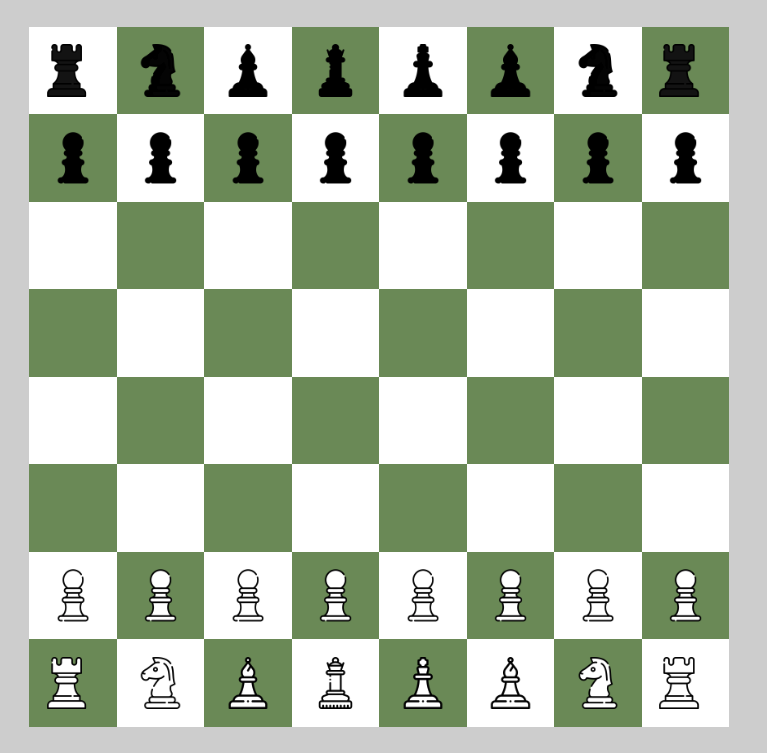
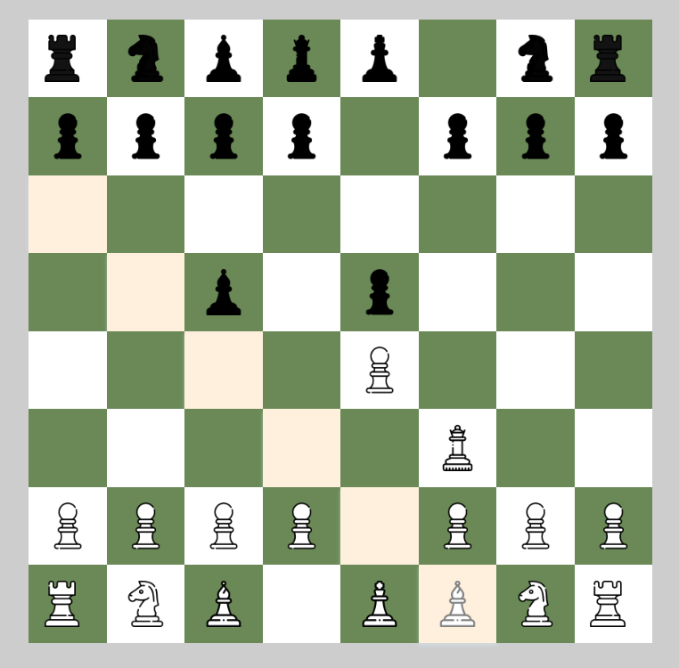
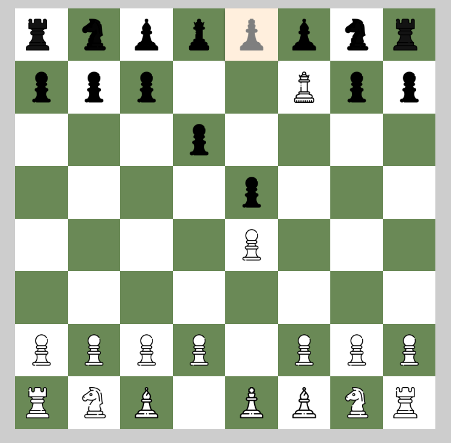
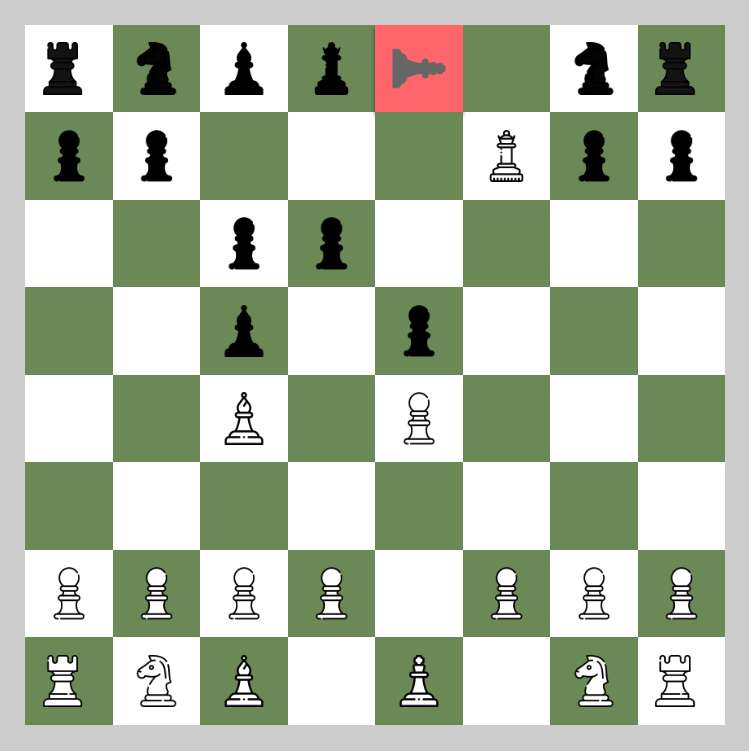

# Chess Game

A simple chess game built using vanilla JavaScript. This game features a dynamic board where pieces can be moved according to standard chess rules. The game highlights possible moves, checks, and checkmates, offering a visual and interactive experience.

## Table of Contents

1. [Tech Stack](#tech-stack)
2. [Features](#features)
3. [Installation](#installation)
4. [Usage](#usage)
5. [Contributing](#contributing)

## Tech Stack

- HTML/CSS: Structure and styling of the game interface using Flexbox for layout.
- JavaScript (Vanilla JS): Implements the game logic using object-oriented programming (OOP) for piece management and functional programming for game rules and interactions.

## Features

- **Dynamic Board:** Visual representation of the chessboard and pieces.
- **Move Highlighting:** Highlights possible moves for selected pieces.
- **Check and Checkmate Detection:** Alerts when the king is in check or checkmate.
- **Object-Oriented Design:** Pieces are modeled using JavaScript classes for better code organization and reuse.

## Installation

No installation is required. Simply clone the repository and navigate to the project folder:

```bash
  git clone https://github.com/ricardo-0103/Ajedrez.git
  cd Ajedrez
```

## Usage

Open index.html in your web browser.
The board is displayed with all pieces set in their initial positions, ready to start the game.



The first turn is for the white pieces. Once you move a piece, immediately starts the turn of the other player. 
When a piece is selected, the possible moves for that piece are highlighted on the board.



If you select one of the opposite pieces in your turn to move it, nothing will happen. Yo can only select and move your own pieces.

The king is highlighted to indicate that it is in check, showing the user that he needs to address the threat. Therefore, he can only move the king or any other piece that prevents the check.




If there are no possible moves, the king square will be shown in red, indicating the end of the game.



## Contributing

Contributions are welcome! If you have suggestions for improvements or new features, please create an issue or submit a pull request. 
